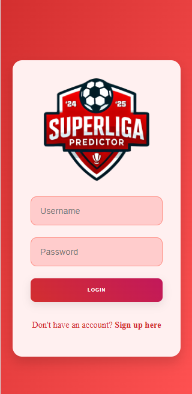
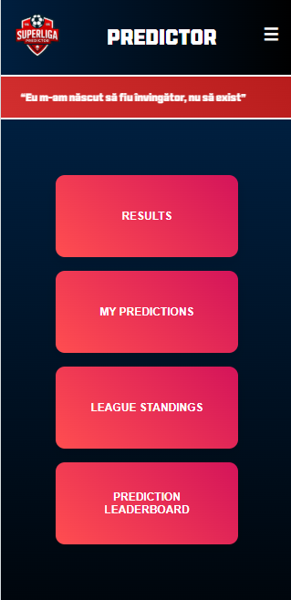
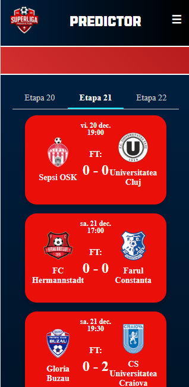
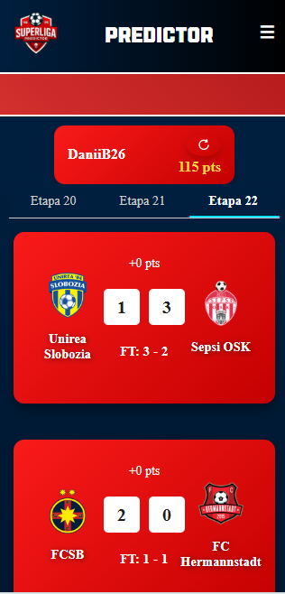
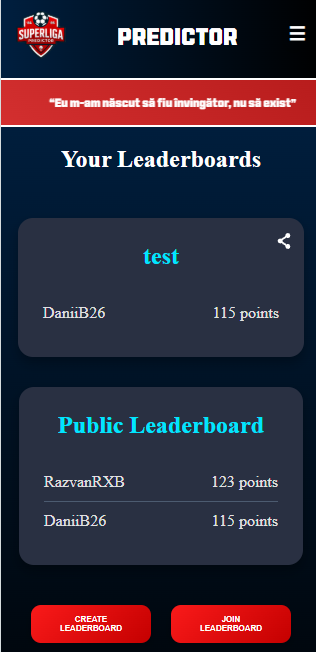

# Superliga Predictor

**Superliga Predictor** is a mobile-first application, but it can also be used on desktop, where multiple users can compete by making predictions on football matches from the Romanian league championship. The rules are simple:

- Guessing the correct score earns **3 points**.  
- Predicting the winning team or a draw earns **1 point**.

---

## Features

- **Signup and Login Pages**: Secure user registration and authentication.  
- **Home Page**: A hub for users to navigate the app.  
- **Match Results**: Displays the results of completed matches.  
- **User Predictions**: A dedicated page to track the user's predictions.  
- **League Standings and Prediction Standings**: Shows the current standings of teams in the league. Ranks teams based on user predictions. 
- **User Leaderboards**: Includes a public leaderboard and the ability for users to create private leaderboards to compete with friends.

---

## Technical Details

The application is divided into two main parts:

### Backend

- Built with **Java** using the **Spring Framework**.
- **MongoDB** is used for database management.
- A **Python script** scrapes match results from an external website to automatically calculate points and update leaderboards.
- **Security**:
  - **JWT-based Authentication**: The backend uses JSON Web Tokens (JWT) for secure and stateless authentication. 
  - **Password Encryption**: User passwords are hashed using **BCryptPasswordEncoder** for enhanced security.  
  - **Stateless Sessions**: Each request is validated independently using JWTs, eliminating the need for server-side session storage.
  - **Environment Variables**: Managed with a `.env` configuration loaded using the `DotenvConfig` class.

### Frontend

- Developed with **React** using the **Ionic Framework** for a responsive and modern user interface.

---

## Screenshots

### Login Page

### Home Page

### Match Results Page

### User Predictions Page

### Leaderboard

---